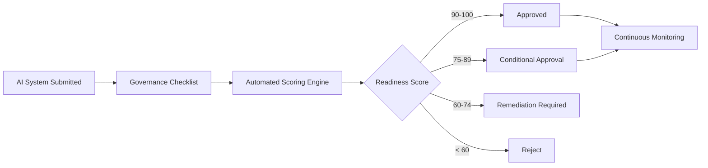

  

# Responsible AI Deployment Framework

A pre-deployment governance framework that evaluates whether an AI system is ready for production by scoring it across seven Responsible AI domains — **privacy, fairness, transparency, security, accountability, reliability & safety, and human oversight** — before it ever reaches customers.

Built around a hypothetical case: **GlobalBank Digital Services** evaluating an AI-powered Customer Advisory Assistant for production release.

## What's Inside

📄 **[Responsible-AI-Deployment-Framework.md](Responsible-AI-Deployment-Framework.md)** — the full framework: architecture diagrams, the seven scored domains, the weighted scoring formula, deployment readiness thresholds, a worked example assessment, the governance decision tree, required audit evidence, the monitoring workflow, and key deliverables.

## At a Glance

| Domain | Weight |
|---|---|
| Privacy | 20% |
| Fairness | 20% |
| Transparency | 15% |
| Security | 15% |
| Accountability | 10% |
| Reliability & Safety | 10% |
| Human Oversight | 10% |

**Worked example:** the Customer Advisory Assistant scores **88%** — Conditionally Approved, pending stronger transparency disclosures and expanded multilingual fairness testing.

## References

This framework is grounded in recognized Responsible AI standards:

- [Microsoft Responsible AI Principles](https://www.microsoft.com/en-us/ai/responsible-ai) — fairness, reliability and safety, privacy and security, transparency, accountability, and inclusiveness
- [NIST AI Risk Management Framework](https://www.nist.gov/itl/ai-risk-management-framework) — trustworthy AI characteristics including privacy enhancement, transparency, accountability, reliability, safety, and managed bias
- [NIST AI RMF Core](https://airc.nist.gov/airmf-resources/airmf/5-sec-core/) — Govern, Map, Measure, Manage
- [OWASP GenAI Security Project](https://genai.owasp.org/) — prompt injection risks and defensive testing guidance
