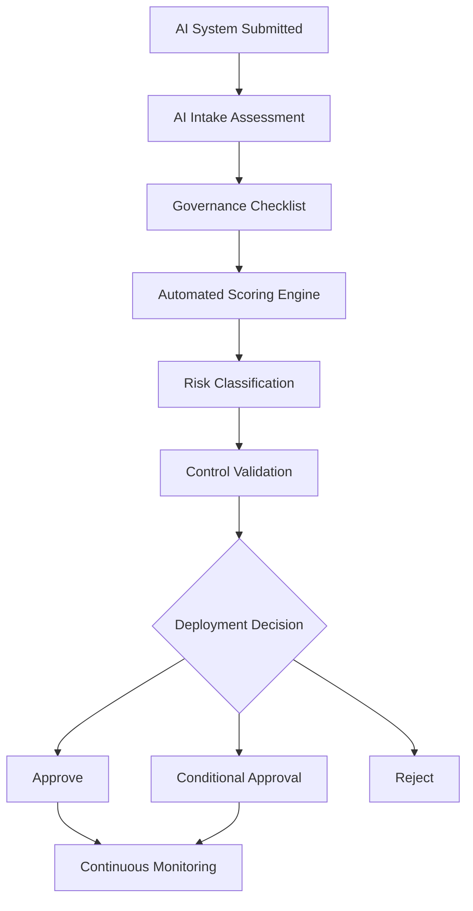
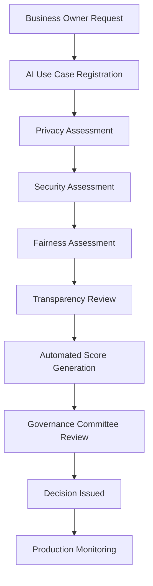
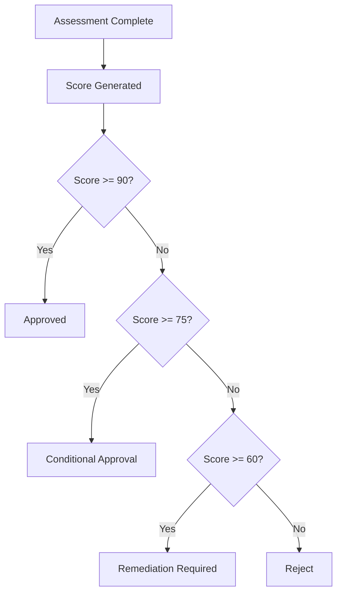
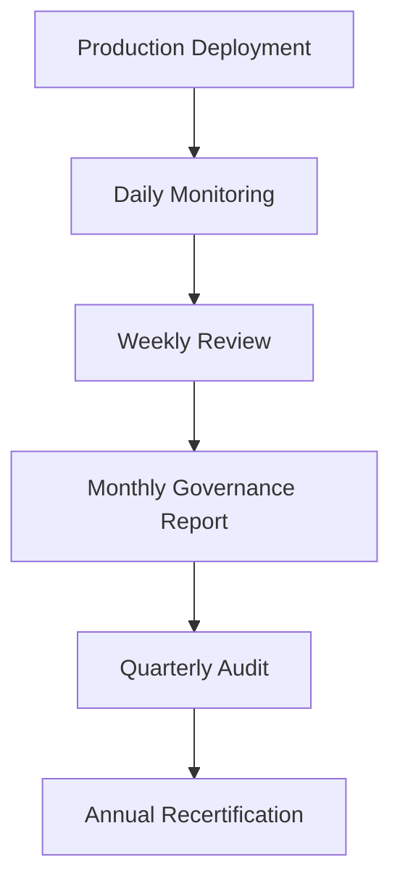

# Responsible AI Deployment Framework

## Project Overview

**Organization:** GlobalBank Digital Services (Hypothetical Enterprise)

**System:** AI-Powered Customer Advisory Assistant

**Project Goal:** Create a pre-deployment governance framework that evaluates whether an AI system is ready for production use by assessing privacy, fairness, transparency, security, accountability, reliability, and human oversight controls.

The framework combines a governance checklist, an automated scoring engine, a risk classification methodology, a deployment workflow, approval gates, audit evidence requirements, and monitoring and review procedures. It is designed to ensure that AI systems meet Responsible AI requirements before deployment and remain compliant throughout their lifecycle.

Microsoft identifies fairness, reliability and safety, privacy and security, transparency, accountability, and inclusiveness as core Responsible AI principles. [[microsoft.com]](https://www.microsoft.com/en-us/ai/responsible-ai)

NIST's AI Risk Management Framework similarly describes trustworthy AI as requiring characteristics such as privacy enhancement, transparency, accountability, reliability, safety, and fairness with harmful bias managed. [[nist.gov]](https://www.nist.gov/itl/ai-risk-management-framework) [[airc.nist.gov]](https://airc.nist.gov/airmf-resources/airmf/5-sec-core/)

## Business Problem

Most organizations deploy AI with technical testing but lack consistent governance reviews. This creates risks such as privacy violations, unfair outcomes, hallucinations, weak transparency, security vulnerabilities, regulatory exposure, and lack of accountability.

The Responsible AI Deployment Framework introduces a repeatable approval process before any AI system reaches production.

## Framework Architecture



## Deployment Workflow



## Responsible AI Assessment Domains

The framework evaluates seven accountability domains, each scored out of 30 points and weighted into a final readiness score.

### Domain 1: Privacy — Weight 20%

- Has personal data been minimized?
- Is consent recorded where required?
- Are retention periods defined?
- Is sensitive data encrypted?
- Is data-access logging enabled?
- Has a privacy impact assessment been completed?

### Domain 2: Fairness — Weight 20%

- Has fairness testing been completed?
- Are protected groups evaluated?
- Is bias documented?
- Are mitigation plans documented?
- Are fairness metrics monitored?
- Has human review validated results?

NIST notes that trustworthiness requires fairness with harmful bias managed and emphasizes that organizations should use human judgment in determining trustworthiness metrics and thresholds. [[nist.gov]](https://www.nist.gov/itl/ai-risk-management-framework) [[airc.nist.gov]](https://airc.nist.gov/airmf-resources/airmf/5-sec-core/)

Microsoft's Responsible AI guidance also highlights disaggregated evaluation as part of fairness assessment. [[microsoft.com]](https://www.microsoft.com/en-us/ai/responsible-ai)

### Domain 3: Transparency — Weight 15%

- Model card completed?
- Intended use documented?
- Limitations documented?
- Training data documented?
- Monitoring plan documented?
- User disclosures available?

### Domain 4: Security — Weight 15%

- Security testing completed?
- Prompt injection tested?
- Access controls implemented?
- Logging enabled?
- Incident response plan defined?
- Security approval granted?

Prompt injection is a documented generative AI risk where model behavior may be altered through inputs, and OWASP recommends safeguards, testing, and ongoing defenses. [[genai.owasp.org]](https://genai.owasp.org/)

### Domain 5: Accountability — Weight 10%

- Business owner assigned?
- Technical owner assigned?
- Governance owner assigned?
- Audit evidence retained?
- Incident escalation process defined?
- Approval records maintained?

### Domain 6: Reliability & Safety — Weight 10%

- Accuracy target achieved?
- Hallucination testing completed?
- Stress testing completed?
- Failure scenarios documented?
- Monitoring thresholds established?
- User escalation available?

### Domain 7: Human Oversight — Weight 10%

- Human review required?
- Override capability available?
- Appeal process available?
- Escalation workflow documented?
- High-risk decisions reviewed?
- Accountability maintained?

## Automated Scoring System

Each assessment question is scored: **Yes = 5 points · Partial = 3 points · No = 0 points**, for a domain maximum of 30 points.

### Weighted Risk Formula

```
Final Score =
    (Privacy       x 20%) +
    (Fairness      x 20%) +
    (Transparency  x 15%) +
    (Security      x 15%) +
    (Accountability x 10%) +
    (Reliability   x 10%) +
    (Human Oversight x 10%)
```

### Deployment Readiness Levels

| Score | Status |
|---|---|
| 90–100 | Approved |
| 75–89 | Conditional Approval |
| 60–74 | Requires Remediation |
| Below 60 | Reject |

## Example Assessment — AI Customer-Service Assistant

| Domain | Raw Score | Weighted Result |
|---|---|---|
| Privacy | 28 / 30 | 93% |
| Fairness | 25 / 30 | 84% |
| Transparency | 24 / 30 | 80% |
| Security | 27 / 30 | 90% |
| Accountability | 29 / 30 | 97% |
| Reliability | 26 / 30 | 87% |
| Human Oversight | 30 / 30 | 100% |
| **Overall Score** | | **88%** |

**Decision:** Conditionally Approved

**Remediation Required:**

- Improve transparency disclosures
- Expand fairness testing
- Add multilingual bias assessments

## Governance Decision Tree



## Required Audit Evidence

The framework requires evidence before approval.

| Category | Required Evidence |
|---|---|
| Privacy | Privacy Impact Assessment, data inventory, consent records |
| Fairness | Fairness test report, bias assessment, mitigation evidence |
| Security | Penetration test, security review, access review |
| Transparency | Model card, transparency report, user disclosures |
| Operations | Monitoring dashboard, incident plan, escalation workflow |

## Monitoring Workflow



### Production Monitoring Metrics

| Domain | Tracked Metrics |
|---|---|
| Privacy | Sensitive-data incidents, unauthorized access attempts |
| Fairness | Bias drift metrics, protected-group performance variance |
| Transparency | Disclosure compliance |
| Reliability | Accuracy, hallucination rate, escalation rate |
| Security | Prompt injection attempts, security alerts |
| Human Oversight | Override usage, human-review frequency |

## Governance Benefits

| Area | How the Framework Helps |
|---|---|
| Privacy Protection | Data minimization, consent validation, access controls |
| Fairness Assurance | Bias testing, mitigation tracking, continuous monitoring |
| Transparency | Model documentation, user disclosures, audit trails |
| Accountability | Defined owners, decision records, governance approvals |
| Security | Threat monitoring, prompt injection defenses, incident response |
| Compliance Readiness | Evidence collection, audit readiness, standardized controls |

## Key Deliverables

1. Responsible AI Deployment Checklist
2. Deployment Readiness Scorecard
3. Automated Scoring Engine
4. Governance Decision Register
5. Fairness Assessment Template
6. Privacy Review Template
7. Security Assessment Template
8. Model Card Template
9. Monitoring Dashboard Specification
10. Incident Response Playbook
11. Approval Workflow
12. Risk Register

## Final Governance Decision Example

| Field | Value |
|---|---|
| System | Customer Advisory Assistant |
| Readiness Score | 88% |
| Risk Classification | Medium |
| Decision | Conditionally Approved |

**Required Actions:**

- Improve transparency documentation
- Complete additional fairness testing
- Validate multilingual performance
- Review deployment after 90 days
